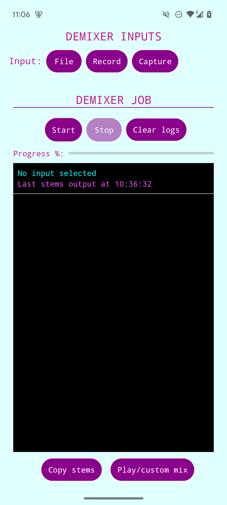
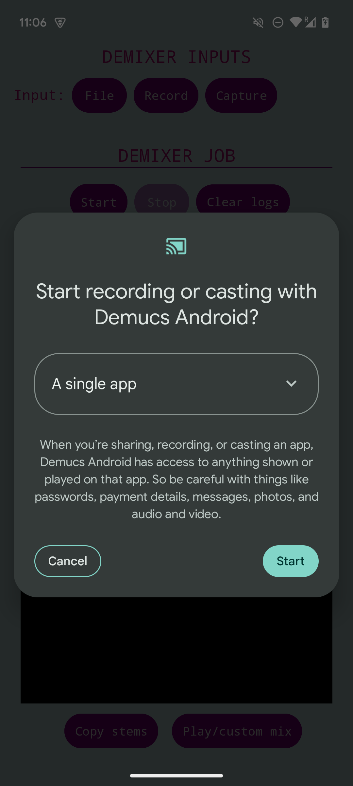
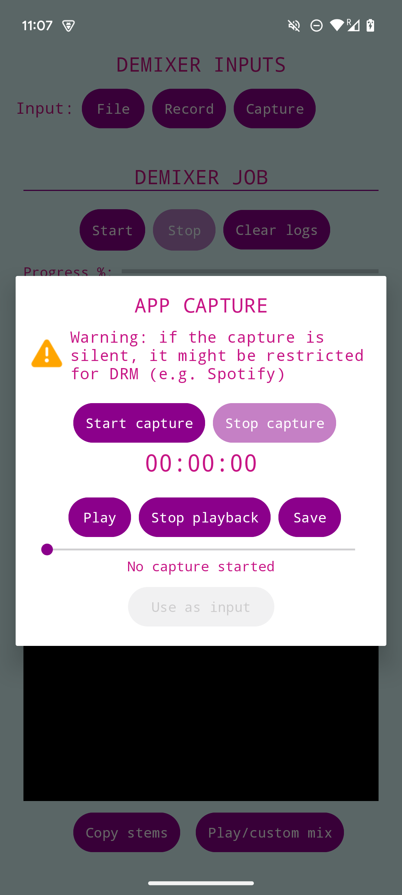
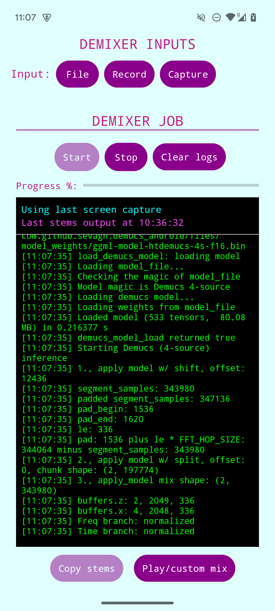
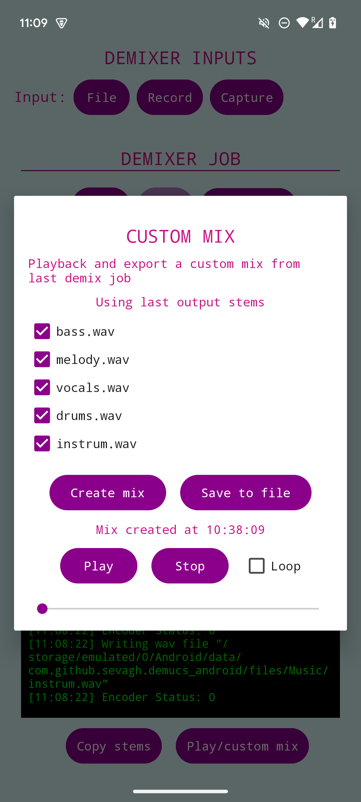

# Demucs Android

Open-sourced a cutdown version of the Android app for <https://freemusicdemixer.com> after removing it from the Play Store and deprecating it.

The app uses [demucs.cpp](https://sevagh/demucs.cpp) to run the Demucs Hybrid-Transformer v4 (htdemucs) 4-source music source separation model to create an end-to-end Android app with Kotlin and C++ inference code in the native NDK.

App inputs:
* Audio file upload/selection intent (from phone storage, Google Drive, etc.)
* Record from microphone
* Capture audio from another app (e.g. YouTube Music)

App outputs:
* Stems (user chooses where to copy to disk)
* Custom mix (combine stems and playback, loop, export a custom mix)

## How to build

Clone the repo, set up Android Studio, and load up this project. Not much else to it.

## Screenshots

    
